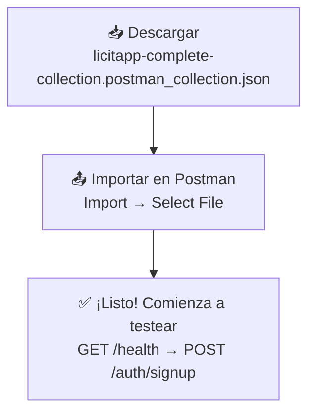

# 🎯 INICIO RÁPIDO - Colección Postman LicitApp

> **Archivo JSON:** `licitapp-complete-collection.postman_collection.json` (80 KB, 59 endpoints)

---

## ⚡ En 3 Pasos



---

## 📋 Archivos de Documentación

```
📁 backend/
├── 📄 licitapp-complete-collection.postman_collection.json  ← COLECCION PRINCIPAL
│
├── 📚 DOCUMENTACION:
│   ├── QUICKSTART_POSTMAN.md ...................... ⚡ LEE ESTO PRIMERO (5 min)
│   ├── POSTMAN_COLLECTION_GUIDE.md ............... 📖 Guía completa (30 min)
│   ├── POSTMAN_SUMMARY.md ........................ 📊 Resumen ejecutivo
│
└── 🔗 REFERENCIAS:
    ├── ENDPOINTS_AUDIT.md ........................ (documentación anterior)
    ├── TESTING_GUIDE.md .......................... (testing anterior)
    └── EXPLORACION_COMPLETA_USERS.md ............ (info de DTOs)
```

---

## 🚀 Flujo de Inicio (< 10 minutos)

### 1. Importar Colección ✅
```
Postman (en tu PC)
  → Menú Superior Izquierdo: "Import"
  → Selecciona: licitapp-complete-collection.postman_collection.json
  → ✅ Completado
```

### 2. Verificar Servidor ✅
```
Ejecutar: GET /health
Esperado: 
  {
    "status": "OK",
    "timestamp": "2026-04-19T10:30:00.000Z",
    "uptime": 12345.67
  }
```

### 3. Crear Cuenta (2 Pasos) ✅

**PASO A: Signup (Registrar Email)**
```
POST /auth/signup
Body:
{
  "email": "tu-email@example.com",
  "firstName": "Tu",
  "lastName": "Nombre"
}

Respuesta: 201 Created
Message: "Email enviado. Token válido 24h"
```

**ESPERAR:** Email con token de verificación

**PASO B: Completar Signup (Establecer Contraseña)**
```
POST /auth/complete-signup/[TOKEN_DEL_EMAIL]
Body:
{
  "password": "SecurePass123!",
  "confirmPassword": "SecurePass123!"
}

Respuesta: 200 OK + Tokens
{
  "access_token": "eyJhbGc...",
  "refresh_token": "eyJhbGc...",
  "user": {...}
}

✅ Guardados automáticamente en variables
```

### 4. ¡Comienza! ✅

Ahora puedes ejecutar cualquier endpoint:

```
GET /auth/me              → Tu perfil
POST /organizations       → Crear organización
POST /tags/private        → Crear etiqueta
POST /alerts              → Crear alerta
GET /licitaciones         → Buscar licitaciones
```

---

## 📊 Lo Que Incluye (59 Endpoints)

### 🔐 Authentication (8)
```
✅ POST   /auth/signup
✅ POST   /auth/complete-signup/:token
✅ POST   /auth/login
✅ POST   /auth/refresh
✅ GET    /auth/me
✅ POST   /auth/logout
✅ GET    /auth/google
✅ GET    /auth/google/callback
```

### 👥 Users (10)
```
✅ GET    /users
✅ GET    /users/:userId
✅ PATCH  /users/:userId
✅ POST   /users/:userId/deactivate
✅ POST   /users/:userId/activate
✅ DELETE /users/:userId
✅ POST   /users/password/request
✅ POST   /users/password/confirm
✅ PATCH  /users/password/change
✅ GET    /users/organization/:organizationId
```

### 🏢 Organizations (5)
```
✅ POST   /organizations
✅ GET    /organizations/:id
✅ GET    /organizations
✅ PATCH  /organizations/:id
✅ GET    /organizations/:id/user-count
```

### 🏷️ Tags (16)
```
✅ POST   /tags/global
✅ GET    /tags/global
✅ GET    /tags/category/:category
✅ GET    /tags/search?q=term
✅ GET    /tags/:id
✅ PATCH  /tags/:id
✅ DELETE /tags/:id
✅ POST   /tags/private
✅ GET    /tags/my/all
✅ GET    /tags/my/pinned
✅ POST   /tags/:id/subscribe
✅ DELETE /tags/:id/unsubscribe
✅ PATCH  /tags/:id/pin
✅ POST   /tags/:id/vote-to-global
✅ GET    /tags/candidates/global
✅ POST   /tags/:id/promote-to-global
```

### 🚨 Alerts (5)
```
✅ POST   /alerts
✅ GET    /alerts
✅ GET    /alerts/:id
✅ PATCH  /alerts/:id
✅ DELETE /alerts/:id
```

### 📧 Invitations (4)
```
✅ POST   /invitations
✅ POST   /invitations/:token/accept
✅ GET    /invitations/organization/:organizationId
✅ DELETE /invitations/:id
```

### 📋 Licitaciones (3)
```
✅ GET    /licitaciones
✅ GET    /licitaciones/filters
✅ GET    /licitaciones/:id
```

### 🔄 Scraping (5)
```
✅ POST   /scraping/place/run
✅ POST   /scraping/place/historical/:period
✅ POST   /scraping/place/historical-all
✅ GET    /scraping/stats
```

### ❤️ Health (3)
```
✅ GET    /health
✅ GET    /health/ready
✅ GET    /health/live
```

---

## 🎨 Características

### 🔐 Seguridad
```
✅ Pre-request scripts automáticos
✅ Validación de tokens
✅ Rate limiting (5 intentos/15 min)
✅ Role-based access control
✅ Ownership validation
```

### 🧪 Testing
```
✅ 59/59 endpoints con tests
✅ Validación de status codes
✅ Validación de estructura de respuesta
✅ Captura automática de IDs y tokens
```

### 🗂️ Organización
```
✅ 9 categorías temáticas
✅ Nombre descriptivo por endpoint
✅ Ejemplos de payloads
✅ Descripción de cada request
```

### 📍 Variables Automáticas
```
baseUrl           → http://localhost:3000
access_token      → Se captura en login
refresh_token     → Se captura en login
userId            → Se captura en login
organizationId    → Se captura en POST /organizations
tagId             → Se captura en POST /tags
alertId           → Se captura en POST /alerts
invitationId      → Se captura en POST /invitations
```

---

## 🎯 Casos de Uso

### Desarrollador Local
```
1. Importar colección
2. POST /auth/signup
3. POST /auth/complete-signup
4. Testear endpoints libremente
```

### QA / Testing
```
1. Importar colección
2. Ejecutar "Run Collection"
3. Ver resultados de tests
4. Generar reporte
```

### Documentación
```
1. Usar Postman directamente
2. Compartir colección con equipo
3. Exportar documentación
```

### Integración CI/CD
```
newman run licitapp-complete-collection.postman_collection.json \
  -e environment.json \
  -r json
```

---

## ✨ Flujos Pre-configurados

### Flujo: Crear Alerta
```
1. POST /auth/login
2. POST /organizations
3. POST /tags/private
4. POST /tags/:id/subscribe
5. POST /alerts
```

### Flujo: Invitar Usuario
```
1. POST /auth/login (como owner)
2. POST /invitations
3. Usuario: POST /invitations/:token/accept
```

### Flujo: Búsqueda
```
1. GET /licitaciones/filters
2. GET /licitaciones?search=X
3. GET /licitaciones/:id
```

---

## 🛠️ Solución de Problemas

### Error: "No token provided"
```
Solución: Ejecuta primero POST /auth/login
```

### Error: "Rate limit exceeded (429)"
```
Solución: Espera 15 minutos o cambia el baseUrl
```

### Error: "Email already registered"
```
Solución: Usa otro email o limpia la BD
```

### Email no llega
```
Solución: 
- Revisa spam/junk
- Verifica SMTP configurado
- Reinicia servidor
```

---

## 📞 Ayuda & Documentación

| Recurso | Ubicación |
|---------|-----------|
| Quickstart (⚡ 5 min) | QUICKSTART_POSTMAN.md |
| Guía Completa (📖 30 min) | POSTMAN_COLLECTION_GUIDE.md |
| Resumen Ejecutivo | POSTMAN_SUMMARY.md |
| Swagger Docs | http://localhost:3000/api/docs |
| API Reference | http://localhost:3000/api-json |

---

## ✅ Checklist de Verificación

- [ ] Postman instalado en tu máquina
- [ ] Backend corriendo en http://localhost:3000
- [ ] Archivo `licitapp-complete-collection.postman_collection.json` descargado
- [ ] Colección importada en Postman
- [ ] GET /health retorna 200 OK
- [ ] POST /auth/signup funciona
- [ ] Email recibido con token
- [ ] POST /auth/complete-signup funciona
- [ ] GET /auth/me muestra tu perfil
- [ ] Variables se llenan automáticamente

---

## 🎉 ¡Listo para Usar!

```
┌─────────────────────────────────────┐
│  ✅ COLECCION POSTMAN COMPLETA      │
│                                     │
│  59 Endpoints                       │
│  9 Categorías                       │
│  8 Variables Globales               │
│  59 Tests Automatizados             │
│  3 Documentos de Guía               │
│                                     │
│  Estado: PRODUCTION READY           │
└─────────────────────────────────────┘
```

**Próximo paso:**
1. 📥 Importa la colección en Postman
2. 📖 Lee [QUICKSTART_POSTMAN.md](QUICKSTART_POSTMAN.md)
3. ✅ ¡Comienza a testear!

---

**Generado:** 19 de abril de 2026  
**Versión:** 1.0  
**Autor:** GitHub Copilot
